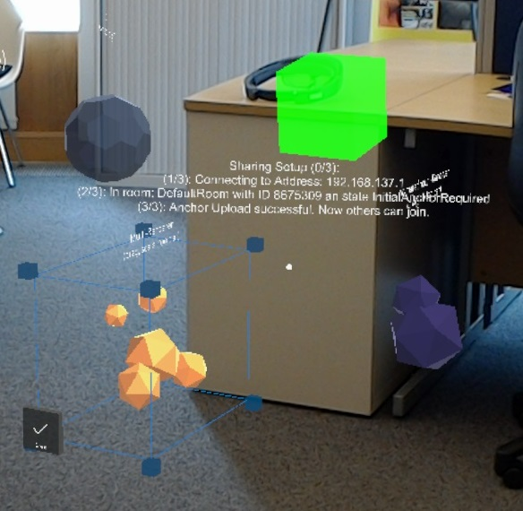

# Share-UpdateHolograms
Syncs and keeps synced objects positions, rotations and scaling via "the old way" of sharing of the HTK. Based upon MRDesignLabs for fancy objects.

Image showing some shared objects and the green headbox on the other hololens (It's a bit off due to the roomscan).

How to use

Example Scene:
Share-UpdateHolograms/ShareAndKeepSynced/Assets/Scenes/SharedAndUpdatingExampleScene.unity

You need these two scripts: SyncManager.cs and SyncMessaging.cs which are located under: Share-UpdateHolograms/ShareAndKeepSynced/Assets/HoloToolKit/Sharing/Tests/Scripts/

Set up sharing as usual, replace RemoteHeadManager.cs and CustomMessages.cs with the two scripts above. You have to manually add objects you want to keep synched to the public List part of SyncManager.cs

